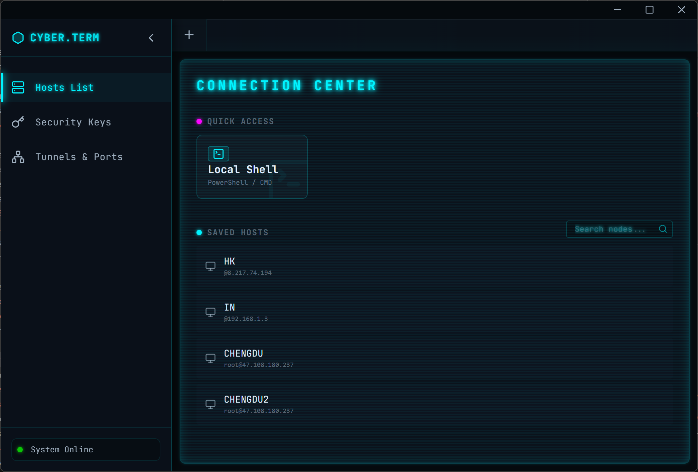
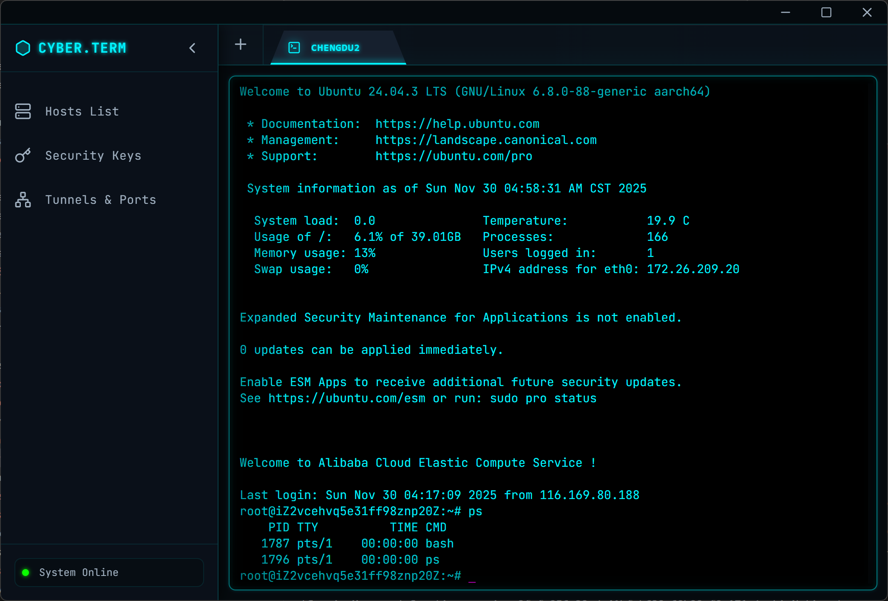

<div align="center">
  

  <h1>Flux Terminal</h1>

  <p>
    <strong>The Cyberpunk-Themed, High-Performance Terminal for the Modern Hacker.</strong>
  </p>

  <p>
    
    
    
    
  </p>
  
  <br />
  
  
</div>

---

## ⚡️ Introduction

**Flux Terminal** is an immersive workspace designed for developers who live in the terminal. Built with **Electron**, **Vue 3**, and **TypeScript**, Flux combines raw performance with a stunning, customizable Cyberpunk aesthetic.

Whether you are managing a fleet of cloud servers or hacking on your local machine, Flux provides a seamless, visual-first experience.

## 📸 Gallery

| **Local Terminal Mode** | **Remote SSH Connection** |
|:---:|:---:|
|  |  |
| *Seamless integration with PowerShell, CMD, and WSL.* | *Robust SSH client with key management and real-time logs.* |

## 🚀 Key Features

* **Cyberpunk Aesthetics**: A strictly dark, neon-infused UI designed to reduce eye strain.
* **Smart Session Manager**: Organize your SSH connections with tags, aliases, and quick search.
* **Robust SSH Core**: Built on top of `ssh2` with intelligent connection healing.
* **Local & Remote**: Seamlessly switch between your local Shell (PowerShell/Bash) and remote servers.
* **Hardware Accelerated**: Powered by `xterm.js` with WebGL rendering for 60fps performance.

## 🛠 Tech Stack

* **Core**: Electron, Vite
* **Frontend**: Vue 3 (Composition API), Pinia
* **Styling**: TailwindCSS v4
* **Terminal**: xterm.js, node-pty
* **SSH**: ssh2

## 📦 Installation

```bash
# Clone the repository
git clone [https://github.com/yourusername/flux-terminal.git](https://github.com/yourusername/flux-terminal.git)

# Install dependencies
npm install

# Start Development Server
npm run dev
